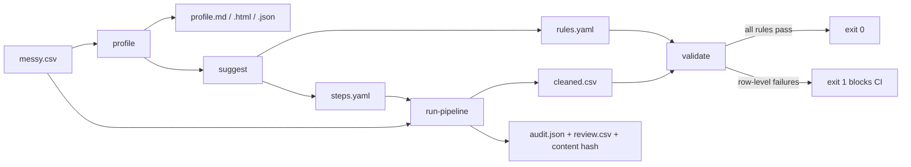
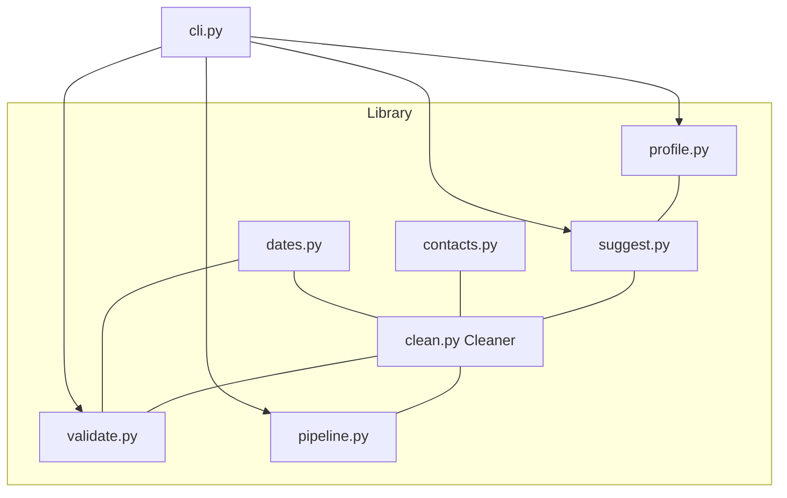

# data-cleaning-toolkit

**The unglamorous 80% of data work, done well.** Profile messy CSVs, turn the
profile into a starter pipeline and rule set, standardize types, categories,
emails, phones and names, dedupe (exactly or fuzzily), validate against a rules
file, and run a reproducible, audited cleaning pipeline. A small pandas library
plus a CLI.


---

## Why

Every tutorial shows the model. Nobody shows the two days of work before it:
figuring out that `Balance (USD)` is text with `1.234,56` in it, that `Country`
has five spellings of "Panama", that a third of the rows are near-duplicate
CRM exports, and that someone typed `13/02/2023` and `Jan 15 2023` in the same
column.

`cleankit` is the boring toolbox for exactly that. It does five things and it
writes down everything it did:

1. **Profile** — look at the data honestly, before touching it.
2. **Suggest** — turn what the profile found into a commented `steps.yaml` and `rules.yaml`.
3. **Clean** — a library of small, logged operations you compose.
4. **Validate** — assert your assumptions with a rules file; fail CI when they break.
5. **Reproduce** — one declarative pipeline, a content hash, and a full audit log.

No cloud service, no API key, three runtime dependencies (`pandas`, `numpy`,
`PyYAML`). It reads CSVs as raw strings so the mess stays visible instead of
being silently coerced away by a `read_csv` default.

## Flow



The loop is deliberate: **profile** so you know what you have, encode the fixes
as a **pipeline**, assert the result with **rules**, and keep the **audit** so
the run is explainable and repeatable. `suggest` writes the first draft of the
pipeline and the rules for you.



## Quickstart

```bash
git clone https://github.com/AleBrito124356/data-cleaning-toolkit.git
cd data-cleaning-toolkit

python -m venv .venv && source .venv/bin/activate   # Windows: .venv\Scripts\activate
pip install -r requirements.txt                     # or: pip install -e ".[dev]"

cp .env.example .env                                # optional; only sets CLI defaults
```

There are no secrets to configure — `cleankit` runs entirely offline. `.env`
only holds CLI defaults (see [Configuration](#configuration)).

Run everything against the bundled messy dataset:

```bash
python cli.py profile data/messy_sample.csv --out profile.html
python cli.py run-pipeline data/messy_sample.csv --steps steps.yaml \
    --out cleaned.csv --report run_report.md --audit audit.json --review-out review.csv
python cli.py validate cleaned.csv --rules rules.yaml --report validation.md
```

After `pip install -e .` the same commands are available as `cleankit ...` and
`python -m cleankit ...`.

## Usage

### Profile

```bash
python cli.py profile data/messy_sample.csv --out profile.html
```

```text
Profiled 20 rows x 11 cols (1 duplicate rows, 24 suspected issues).
Wrote html profile to profile.html
```

Every column gets an inferred type (`integer`, `float`, `boolean`, `datetime`,
`email`, `phone`, `categorical`, `text`), a semantic role where one is evident
(`identifier`, `person_name`, `address`, `country`), missingness, cardinality,
a distribution summary, outliers, examples and suspected issues. On the bundled
file it reports, among 24 findings:

```text
Customer ID    Key repeated for 3 value(s): 1002, 1005 with differing rows (conflicting records — review, or dedupe with keep: most_complete); 1001 as exact duplicate rows.
Full Name      2 value(s) are whitespace-only (counted as missing; normalize_whitespace turns them into nulls).
Full Name      Inconsistent casing in 8 name(s) (e.g. 'JUAN  Pérez', 'o'brien smith') — standardize_names fixes this.
Email Address  5 value(s) have a mistyped provider domain (e.g. 'maria.gonzalez@gmial.com', 'obrien@hotmail.co').
Country        5 spellings of 'Panamá': Panamá (5), Panama (2), panama (1), Rep. de Panamá (1), panamá (1).
Signup Date    Mixed date formats detected: YYYY-MM-DD (10), DD/MM/YYYY (6), Mon DD YYYY (2), DD-MM-YYYY (1).
Signup Date    Day-first dates present (e.g. 13/02/2023) — parse with dayfirst=True. 3 ambiguous value(s) such as 05/02/2023 will be read day-first.
Balance (USD)  Numbers stored as text with separators in 13 value(s) (e.g. '1,250.00', '2.500,50').
Balance (USD)  Mixed decimal marks: 1 value(s) use ',' (e.g. '2.500,50') and 10 use '.' (e.g. '1,250.00').
Balance (USD)  Ambiguous '.' in 1 value(s) ('1.000' -> 1000): read as thousands because '.' groups thousands elsewhere in this column (e.g. 2.500,50).
Is Active      Inconsistent boolean spellings: yes, true, Y, 1, si, TRUE (true) / no, 0 (false).
Address        5 address(es) use abbreviations or untidy casing (e.g. 'Ave Balboa, Edif Torre', 'PH Ocean, Apto 12B') — clean_addresses expands Ave, Edif, Apto, Cra.
```

`--out` picks the format from the extension: `.md`, `.json` (round-trips
through `ProfileReport.from_dict`) or `.html` — a self-contained page (inline
CSS, no CDN) with a findings list, light and dark themes, and a card layout on
phones. `--format md|html|json` forces one; without `--out` the Markdown goes
to stdout.

### Suggest a pipeline and rules

```bash
python cli.py suggest data/messy_sample.csv --steps-out suggested_steps.yaml --rules-out suggested_rules.yaml
```

```text
Profiled 20 rows x 11 cols; 24 suspected issues.
Wrote 11 step(s) to suggested_steps.yaml
Wrote 17 rule(s) to suggested_rules.yaml
```

The generated files are commented so every choice can be reviewed. An excerpt
of `suggested_steps.yaml`:

```yaml
  # 'country' has 9 spellings of 3 value(s): Panamá <- Panama, panama, Rep. de Panamá; Colombia <- colombia; México <- Mexico.
  - op: standardize_categoricals
    column: country
    canonical: [Panamá, Colombia, México, Costa rica, Ecuador, USA]
    threshold: 0.9
    extra_aliases:
      Rep. de Panamá: Panamá

  # Rewrite phones as E.164. Each row's region comes from 'country'; numbers without a country code default to PA.
  - op: standardize_phones
    columns: [phone]
    default_region: PA
    region_column: country
```

Judgement calls are written as commented-out blocks instead of being applied
(`# - op: handle_missing ... value: median` shows the median it would use),
outliers are flagged rather than capped, and deduplication keeps the most
complete row of each repeated identifier. The rules target the snake_cased
output: `not_null` for complete columns, `unique` + `dtype` for the
identifier, `allowed` for categories and booleans, email and E.164 regexes,
numeric ranges from the observed quartiles (3x IQR, rounded out) and the
`signup_date <= last_login` order that held on every row. Run them and only the
genuinely bad values fail:

```text
FAIL — 5 failure(s) over 16 rows.
  email_address.regex: 2
  age.range: 2
  balance_usd.range: 1
    row 3 (line 5), email_address: does not match pattern ('ana_lopezexample.com')
    row 15 (line 17), email_address: does not match pattern ('valentina.rojasgmail.com')
    row 7 (line 9), balance_usd: 9999999 > max 14000 ('9999999.0')
    row 7 (line 9), age: 150 > max 99 ('150')
    row 13 (line 15), age: 200 > max 99 ('200')
```

`suggest` refuses to overwrite existing files unless you pass `--force`;
without `--steps-out`/`--rules-out` it prints both files to stdout.

### Run a pipeline

```bash
python cli.py run-pipeline data/messy_sample.csv --steps steps.yaml \
    --out cleaned.csv --report run_report.md --audit audit.json --review-out review.csv
```

```text
Wrote pipeline output to cleaned.csv
Rows 20 -> 16, missing cells 15 -> 6, duplicate rows 1 -> 0.
Input hash 0b90aee69dc0387d -> output hash 985d5dc7a72fa732
  1. standardize_column_names: Renamed 11 column(s) to snake_case.
  2. normalize_whitespace: Normalised whitespace/unicode in 8 cell(s) across 1 column(s). 2 whitespace-only cell(s) became null.
  3. handle_missing: Dropped 1 row(s) with missing values in all of 3 column(s).
  4. coerce_types: Coerced 'customer_id' to integer.
  5. coerce_types: Coerced 'signup_date' to datetime. Day-first detected; 3 ambiguous value(s) such as 05/02/2023 were read day-first.
  6. coerce_types: Coerced 'last_login' to datetime.
  7. coerce_types: Coerced 'balance_usd' to float. 3 ambiguous value(s) read from column context (e.g. '3,000' -> 3000).
  8. coerce_types: Coerced 'is_active' to boolean.
  9. coerce_types: Coerced 'age' to integer.
  10. standardize_categoricals: Standardised 'country': mapped 7 variant(s) to 4 canonical value(s) in 11 cell(s); 2 left unmatched.
  11. standardize_names: Standardised names in 'full_name': 8 cell(s) changed.
  12. standardize_emails: Standardised emails in 'email_address': 7 cell(s) changed, 5 domain typo(s) fixed, 2 invalid (kept).
  13. standardize_phones: Standardised phones in 'phone' to E.164: 19 cell(s) changed, 0 invalid, 3 read outside the row's region.
  14. clean_addresses: Cleaned addresses in 'address': 5 cell(s) changed.
  15. handle_missing: Filled 1 missing value(s) across 1 column(s) using 'median'.
  16. handle_outliers: Capped 2 outlier(s) across 1 column(s) via iqr.
  17. deduplicate: Removed 3 duplicate row(s) (3 exact on ['customer_id']), keeping the most complete of each group.
Wrote run report to run_report.md
Wrote audit JSON to audit.json
Wrote 3 duplicate pair(s) to review.csv
```

A few rows of `cleaned.csv`:

```text
customer_id,full_name,email_address,phone,country,signup_date,last_login,balance_usd,is_active,age,address
1003,O'Brien Smith,obrien@hotmail.com,+50762223333,Panama,2023-02-13,2024-03-15,980.0,True,41,"PH Ocean, Apartamento 12B"
1005,Carlos Ruiz,carlos.ruiz@yahoo.com,+573105551234,Colombia,2023-03-20,2024-01-06,1000.0,True,27,"Calle 100, Medellin"
1006,Pedro Martinez,pedro@outlook.com,+525512345678,Mexico,2023-01-15,2024-02-20,12340.75,True,38,"Reforma 100, CDMX"
```

`3105551234` in a Colombia row becomes `+573105551234`, the `1.000` balance
written next to `2.500,50` is one thousand (not one), `Jan 15 2023` and
`13/02/2023` land on the right dates, and ages stay whole numbers after capping.

Steps are checked before anything runs. A misspelled parameter, a value outside
an option's vocabulary or an unknown operation stops the run with exit code 2
and a hint, instead of a traceback or a silent fallback:

```text
error: step 1 (handle_missing): unknown parameter 'colums'. Did you mean 'columns'? Accepted: strategy, columns, value, how
error: step 1 (handle_missing): strategy='fil' is not valid; choose one of: flag, fill, drop_rows, drop_columns. Did you mean 'fill'?
error: step 1: unknown op 'standardize_email'. Did you mean 'standardize_emails'? Allowed: clean_addresses, coerce_types, ...
```

### Validate (CI-friendly)

```bash
python cli.py validate cleaned.csv --rules rules.yaml
echo $?
```

```text
FAIL — 3 failure(s) over 16 rows.
  email_address.regex: 2
  full_name.not_null: 1
    row 12 (line 14), full_name: value is null
    row 3 (line 5), email_address: does not match pattern ('ana_lopezexample.com')
    row 15 (line 17), email_address: does not match pattern ('valentina.rojasgmail.com')
1
```

Each failure carries the 0-based row and the CSV line it came from (quoted
fields that span several lines are accounted for), in the terminal, in
`--report validation.md` and in `--json validation.json`. Customer 1014 has
`"   "` as a name: whitespace-only cells count as null. A failing report exits
`1`, a clean run prints `PASS` and exits `0`, and bad input exits `2`.

### Clean (a profile-driven default pass)

```bash
python cli.py clean data/messy_sample.csv --out cleaned.csv --audit audit.json
```

`clean` runs the safe core of what `suggest` would write: snake_case headers,
whitespace, the inferred types, merged category spellings, and email / phone
(E.164, per-row region) / name / address standardization, then drops exact
duplicate rows. Options: `--region PA|CO|MX|...`, `--no-coerce`,
`--no-contacts`, `--no-categoricals`, `--keep first|last|most_complete`,
`--dedupe-on customer_id`, `--fuzzy-keys full_name,phone --threshold 0.9
--block-on country`, `--keep-duplicates`, and `--review-out review.csv` to get
every duplicate pair side by side.

### As a library

```python
import pandas as pd
from cleankit import Cleaner, validate, load_rules

df = pd.read_csv("data/messy_sample.csv", dtype=str, keep_default_na=False, na_values=[""])

# Compose logged operations — every step chains and records what it changed.
result = (
    Cleaner(df)
    .standardize_column_names()
    .normalize_whitespace()
    .coerce_types({"signup_date": "datetime", "balance_usd": "float", "age": "integer", "is_active": "boolean"})
    .standardize_categoricals("country", canonical=["Panama", "Colombia", "Mexico", "Costa Rica"])
    .standardize_emails(["email_address"])
    .standardize_phones(["phone"], default_region="PA", region_column="country")
    .deduplicate(subset=["customer_id"], keep="most_complete")
)

for entry in result.log[-3:]:          # the audit trail
    print(entry["op"], "-", entry["message"])

report = validate(result.df, load_rules("rules.yaml"))
print("valid:", report.ok, "| failures:", report.failures_by_rule())
```

```text
standardize_emails - Standardised emails in 'email_address': 7 cell(s) changed, 5 domain typo(s) fixed, 2 invalid (kept).
standardize_phones - Standardised phones in 'phone' to E.164: 19 cell(s) changed, 0 invalid, 3 read outside the row's region.
deduplicate - Removed 3 duplicate row(s) (3 exact on ['customer_id']), keeping the most complete of each group.
valid: False | failures: {'full_name.not_null': 2, 'email_address.regex': 2, 'age.range': 2, 'country.allowed': 1}
```

(Without the `extra_aliases` the bundled `steps.yaml` uses, `Rep. de Panamá` is
too far from `Panama` at the default threshold and stays unmatched, which is
exactly what `country.allowed` catches.)

The contact standardizers are importable directly:

```python
from cleankit import to_e164, standardize_email, standardize_name, clean_address, region_for_country

to_e164("6123-4567", default_region="PA").value          # '+50761234567'
to_e164("3105551234", default_region="CO").value         # '+573105551234'
to_e164("3105551234", default_region="PA").valid         # False: not a Panama number
standardize_email("maria@gmial.con").value               # 'maria@gmail.com'
standardize_email("valentina.rojasgmail.com").suggestion # 'valentina.rojas@gmail.com' (never applied)
standardize_name("JUAN de la CRUZ")                      # 'Juan de la Cruz'
clean_address("PH Ocean, Apto 12B")                      # 'PH Ocean, Apartamento 12B'
region_for_country("Rep. de Panamá")                     # 'PA'
```

## Operation catalog

| Operation | What it does | Key options |
| --- | --- | --- |
| `standardize_column_names` | Headers to `snake_case`; guarantees unique names (`Name`, `name`, `name_1` -> `name`, `name_2`, `name_1`) | — |
| `normalize_whitespace` | Trim, collapse spaces, fold exotic unicode spaces, NFKC; whitespace-only cells become null | `columns`, `form` |
| `coerce_types` | Parse to integer/float/boolean/datetime/string | `mapping` (or inferred), `on_fraction` (`round`/`nullify`/`error`) |
| ↳ numbers | `1,234.56`, `1.234,56`, `1 234,50`, `$1,234`, `USD 1,200`, `(1234)`, `50%`, `1e3`; `1.000` resolved from the column's other values and logged | — |
| ↳ dates | Per-value parsing; year-first values never read day-first; day-first voted from unambiguous values | — |
| ↳ booleans | `yes/no/y/n/true/false/1/0/si/on` and more | — |
| `standardize_categoricals` | Fuzzy-map variants onto a canonical set | `column`, `canonical`, `threshold`, `extra_aliases` |
| `standardize_emails` | Lower-case, trim, repair provider typos (`gmial.com`, `.con`) | `columns`, `fix_typos`, `invalid` (`keep`/`null`/`flag`) |
| `standardize_phones` | E.164 with per-country numbering plans (length + leading digits); region per row from a country column | `columns`, `default_region`, `region_column`, `invalid` |
| `standardize_names` | Title case keeping `de/del/la`, `O'Brien`, `McDonald`, `J.R.` | `columns` |
| `clean_addresses` | Expand `Ave/Av/Cra/Cl/Edif/Apto/Dg/Tv`, tidy commas, keep `CDMX`, `PH`, `12B`, `No.` | `columns` |
| `handle_missing` | Drop rows (`how: any/all`), drop empty columns, fill (typed: integer columns get a rounded, logged fill), or flag | `strategy`, `columns`, `value` (`mean/median/mode/ffill/bfill`/constant), `how` |
| `handle_outliers` | Cap (keeps the column's dtype) or flag | `columns`, `method` (`iqr`/`zscore`), `action` (`cap`/`flag`), `factor`, `z` |
| `deduplicate` | Remove or flag exact and fuzzy duplicates; every removal is logged as a pair | `subset`, `keep` (`first`/`last`/`most_complete`), `fuzzy`, `fuzzy_keys`, `threshold`, `block_on`, `flag` |

Every operation appends a structured entry to `Cleaner.log`: the operation
name, a human message, and details such as cells changed, fallbacks, values it
had to interpret (`ambiguous`, `fraction_examples`, `invalid_examples`), fences
used for capping, and duplicate pairs.

## Validation rules

Rules live in `rules.yaml`. Per-column: `not_null`, `unique`, `range`, `regex`,
`allowed`, `dtype`. Cross-field checks compare two columns or a column and a
literal:

```yaml
columns:
  customer_id:
    not_null: true
    unique: true
    dtype: integer
  full_name:
    not_null: true
  email_address:
    regex: '^[^@\s]+@[^@\s]+\.[^@\s]+$'
  phone:
    regex: '^\+[1-9]\d{6,14}(;ext=\d+)?$'
  age:
    range: {min: 18, max: 120}
  country:
    allowed: [Panama, Colombia, Mexico, Costa Rica, USA, Ecuador]
checks:
  - name: signup_not_after_last_login
    left: signup_date
    op: "<="
    right: last_login
```

Cross-field checks compare like with like: date columns are parsed with the
same ISO-safe rules as the cleaner (`2023-01-05` is always 5 January), numeric
text is compared as numbers (`"10" > "9"`), and a literal such as
`right: "2023-01-01"` takes the type of the column it is compared with. An
unknown rule name is reported with a did-you-mean hint.

## Reproducibility and audit

The point of a pipeline is that it is **explainable and repeatable**:

- A run is fully declared in `steps.yaml` — no hidden state, no notebook cells
  executed out of order — and checked before it starts.
- `run_pipeline` computes an **index-independent content hash** of the input and
  output. Same input + same steps → same output hash. The test suite runs the
  CLI twice in separate processes and asserts identical hashes and bytes.
- The **audit log** records each step and what it touched. Row numbers in it
  are positions in the *input* file (the cleaner never renumbers rows while it
  works), so "row 3 was removed as a duplicate of row 0" means CSV lines 5 and 2.
- `--report` writes a Markdown before/after summary with the duplicate pairs,
  `--audit` writes everything as JSON, and `--review-out` writes each duplicate
  pair (removed row and kept row, with CSV line numbers and values) to a CSV
  you can open in a spreadsheet.

## Fuzzy deduplication at scale

Fuzzy dedup compares `difflib` ratios inside blocks (first character of the
key, plus any `block_on` columns). Before 0.2 every candidate was scored
against every kept row. Now a comparison is skipped only when an exact upper
bound of the ratio (the length bound behind `real_quick_ratio` and a vectorised
character-multiset bound equal to `quick_ratio`) is already below the
threshold, so the result is identical — the test suite checks this against a
verbatim copy of the old loop on seeded random data at four thresholds.
`scripts/bench_dedup.py` on realistic names (15% one-typo near duplicates,
threshold 0.9):

```text
   rows   old (s)   new (s)  speed-up  dupes  identical
   2000      5.24      0.09     56.3x    331  True
   5000     39.05      0.26    151.8x    793  True
  20000         -      1.74         -   3832  -
```

## Configuration

`cleankit` reads two optional defaults from the environment or from a `.env`
file in the current directory (a tiny built-in parser; no extra dependency):

| Variable | Used for | Default |
| --- | --- | --- |
| `CLEANKIT_DEFAULT_REGION` | `--region` of `clean` and `suggest` (phones without a country code) | `PA` |
| `CLEANKIT_CSV_SEP` | `--sep` of every command | `,` |

A flag beats an environment variable, which beats `.env`. `--env-file PATH`
reads another file; `--debug` (or `CLEANKIT_DEBUG=1`) shows a traceback instead
of the one-line `error:` message. Known phone regions: AR, BR, CA, CL, CO, CR,
DO, EC, ES, FR, GT, HN, MX, NI, PA, PE, SV, US, VE; an unknown one is an error,
never a silent fallback. Output is always UTF-8, also when piped or redirected
on Windows.

## Project structure

```text
data-cleaning-toolkit/
├── cli.py                  # entry point: profile / suggest / clean / validate / run-pipeline
├── steps.yaml              # example declarative pipeline for the demo data
├── rules.yaml              # example validation rules
├── data/
│   └── messy_sample.csv    # deliberately messy demo dataset
├── scripts/
│   └── bench_dedup.py      # fuzzy dedup benchmark, old vs new
├── src/cleankit/
│   ├── profile.py          # profiling, variant clustering, md/HTML/JSON reports
│   ├── suggest.py          # profile -> commented steps.yaml + rules.yaml
│   ├── clean.py            # Cleaner: composable, logged operations
│   ├── contacts.py         # email / phone E.164 / country / name / address standardizers
│   ├── dates.py            # ISO-safe mixed-format date parsing
│   ├── validate.py         # rules DSL + row-level validation report
│   ├── pipeline.py         # declarative runs, step checks, before/after, content hash
│   ├── text.py             # accent-free keys and typo-tolerant matching
│   ├── config.py           # .env / environment defaults for the CLI
│   └── cli.py              # CLI implementation
├── tests/                  # 188 tests: regressions, CLI, golden demo, dedup equivalence
├── CHANGELOG.md
├── requirements.txt
└── pyproject.toml
```

## Running the tests

```bash
pip install -e ".[dev]"
pytest -q
```

The suite (188 tests, 10-20 seconds depending on the machine) covers type inference, number/date/
boolean parsing, every validation rule, contact standardizers and their
pipeline operations, the profiler's findings on the bundled file, `suggest`
end to end (generate, run, validate), fuzzy-dedup equivalence with the old
algorithm, the CLI's exit codes and outputs (including UTF-8 through a pipe),
and a golden run of `steps.yaml` + `rules.yaml` whose output hash must match
across two processes. Developed and tested on Python 3.14 with pandas 3.0; the
code avoids newer-than-3.9 syntax and pandas APIs newer than 2.1.

## When to reach for a full ETL tool instead

`cleankit` is for a single messy file (or a handful) that fits in memory, cleaned
on a laptop or in a CI job. It is intentionally small. Reach for something bigger
when:

- **Data does not fit in memory** — use Polars, DuckDB, or Spark.
- **You need scheduling, retries, backfills, lineage across many tables** — use
  an orchestrator: Airflow, Dagster, or Prefect.
- **You want declarative warehouse transforms and tests in SQL** — use dbt.
- **You need heavy schema/contract validation as a first-class artifact** — use
  Pandera or Great Expectations (this toolkit's rules file is a lightweight
  cousin, not a replacement).
- **You need exhaustive international phone parsing** — use `phonenumbers`;
  `cleankit` covers the common LATAM numbering plans and says so when a number
  does not fit.

Use `cleankit` for the first mile — understanding and fixing the raw file — and
hand the clean, validated output to whatever runs the rest of the pipeline.

## Related projects

Part of a catalog of practical, free-to-run developer tools:

- **[synthetic-data-factory](https://github.com/AleBrito124356/synthetic-data-factory)** — generate realistic tabular data with referential integrity; the natural upstream when you need test data to clean.
- **[python-automation-toolbox](https://github.com/AleBrito124356/python-automation-toolbox)** — 20 standalone Python automation scripts for the other boring-but-necessary jobs.
- **[structured-extraction-agents](https://github.com/AleBrito124356/structured-extraction-agents)** — turn messy documents into validated JSON with Pydantic when the source is not tabular.
- **[text-to-sql-agent](https://github.com/AleBrito124356/text-to-sql-agent)** — natural language to SQL with guardrails, for once the data is clean and in a database.

## License

MIT — see [LICENSE](LICENSE). Copyright (c) 2026 Alejandro Brito.
