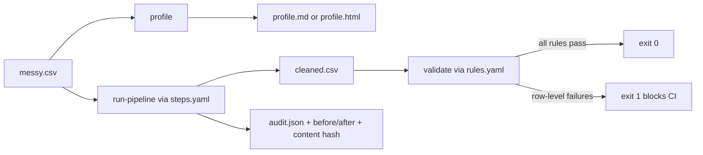
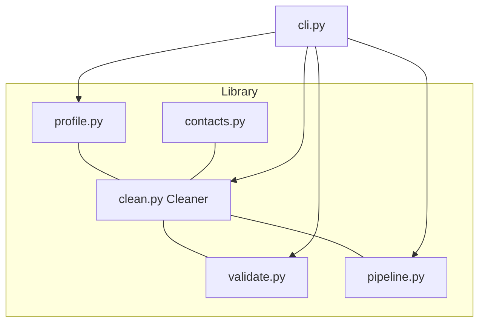

# data-cleaning-toolkit

**The unglamorous 80% of data work, done well.** Profile messy CSVs, standardize
types and categories, dedupe, validate against a rules file, and run a
reproducible, audited cleaning pipeline. A small pandas library plus a CLI.


---

## Why

Every tutorial shows the model. Nobody shows the two days of work before it:
figuring out that `Balance (USD)` is text with `1.234,56` in it, that `Country`
has nine spellings of "Panama", that a third of the rows are near-duplicate
CRM exports, and that someone typed `13/02/2023` and `Jan 15 2023` in the same
column.

`cleankit` is the boring toolbox for exactly that. It does four things and it
writes down everything it did:

1. **Profile** — look at the data honestly, before touching it.
2. **Clean** — a library of small, logged operations you compose.
3. **Validate** — assert your assumptions with a rules file; fail CI when they break.
4. **Reproduce** — one declarative pipeline, a content hash, and a full audit log.

No cloud service, no API key, three runtime dependencies (`pandas`, `numpy`,
`PyYAML`). It reads CSVs as raw strings so the mess stays visible instead of
being silently coerced away by a `read_csv` default.

## Flow



The loop is deliberate: **profile** so you know what you have, encode the fixes
as a **pipeline**, assert the result with **rules**, and keep the **audit** so
the run is explainable and repeatable.



## Quickstart

```bash
git clone https://github.com/AleBrito124356/data-cleaning-toolkit.git
cd data-cleaning-toolkit

python -m venv .venv && source .venv/bin/activate   # Windows: .venv\Scripts\activate
pip install -r requirements.txt                     # or: pip install -e .

cp .env.example .env                                # optional; only sets CLI defaults
```

There are no secrets to configure — `cleankit` runs entirely offline. `.env`
just holds defaults like the phone region (`CLEANKIT_DEFAULT_REGION=PA`).

Run everything against the bundled messy dataset:

```bash
python cli.py profile data/messy_sample.csv --out profile.html
python cli.py run-pipeline data/messy_sample.csv --steps steps.yaml \
    --out cleaned.csv --report run_report.md --audit audit.json
python cli.py validate cleaned.csv --rules rules.yaml --report validation.md
```

After `pip install -e .` the same commands are available as `cleankit ...` and
`python -m cleankit ...`.

## Usage

### Profile

```bash
python cli.py profile data/messy_sample.csv --out profile.md
```

```text
Profiled 20 rows x 11 cols (1 duplicate rows, 6 suspected issues).
```

The report gives every column an inferred type, missingness, cardinality, a
distribution summary, an outlier count, example values, and a list of suspected
issues — "Mixed date formats detected", "Numbers stored as text with
separators", "3 value(s) do not look like valid email addresses". Pass a `.html`
path for a self-contained report (inline CSS, no CDN) you can open in a browser.

### Run a pipeline

```bash
python cli.py run-pipeline data/messy_sample.csv --steps steps.yaml --out cleaned.csv
```

```text
Wrote pipeline output to cleaned.csv
Rows 20 -> 17, missing cells 15 -> 13, duplicate rows 1 -> 0.
Input hash 0b90aee69dc0387d -> output hash 904cff198943aaf5
  1. standardize_column_names: Renamed 11 column(s) to snake_case.
  2. normalize_whitespace: Normalised whitespace/unicode in 21 cell(s) across 10 column(s).
  3. coerce_types: Coerced 'signup_date' to datetime.
  ...
  9. standardize_categoricals: Standardised 'country': mapped 4 variant(s) ...
 12. deduplicate: Removed 3 duplicate row(s) (exact + no fuzzy).
```

### Validate (CI-friendly)

```bash
python cli.py validate cleaned.csv --rules rules.yaml
echo $?
```

```text
FAIL — 2 failure(s) over 17 rows.
  email_address.regex: 2
    row 3, email_address: does not match pattern
    row 16, email_address: does not match pattern
1
```

A failing report exits non-zero, so `cleankit validate` drops straight into a CI
step. A clean run prints `PASS` and exits `0`.

### As a library

```python
import pandas as pd
from cleankit import Cleaner, profile_dataframe, validate, load_rules

df = pd.read_csv("data/messy_sample.csv", dtype=str, keep_default_na=False, na_values=[""])

# Compose logged operations — every step chains and records what it changed.
result = (
    Cleaner(df)
    .standardize_column_names()
    .normalize_whitespace()
    .coerce_types({"signup_date": "datetime", "balance_usd": "float", "age": "integer"})
    .standardize_categoricals("country", canonical=["Panama", "Colombia", "Mexico"])
    .deduplicate(subset=["customer_id"])
)

clean_df = result.df
for entry in result.log:            # the audit trail
    print(entry["op"], "-", entry["message"])

report = validate(clean_df, load_rules("rules.yaml"))
print("valid:", report.ok, "| failures:", report.n_failures)
```

Contact standardizers are importable directly:

```python
from cleankit import to_e164, standardize_email, standardize_name

to_e164("6123-4567", default_region="PA").value   # '+50761234567'
standardize_email("maria@gmial.com").value         # 'maria@gmail.com' (typo fixed)
standardize_name("JUAN de la CRUZ")                # 'Juan de la Cruz'
```

## Operation catalog

| Operation | What it does | Key options |
| --- | --- | --- |
| `standardize_column_names` | Headers to `snake_case`; de-collides duplicates | — |
| `normalize_whitespace` | Trim, collapse repeated spaces, fold exotic unicode spaces, NFKC | `columns`, `form` |
| `coerce_types` | Parse to int/float/bool/datetime/string | `mapping` or auto-infer |
| ↳ numbers | Handles `1,234.56`, `1.234,56`, `1 234,50`, `$1,234`, `(1234)`, `50%` | — |
| ↳ dates | Per-value parsing; day-first auto-detected; ISO stays unambiguous | — |
| ↳ booleans | `yes/no/y/n/true/false/1/0/si/on` and more | — |
| `standardize_categoricals` | Fuzzy-map variants onto a canonical set | `canonical`, `threshold`, `extra_aliases` |
| `handle_missing` | Drop rows, drop empty columns, fill, or flag | `strategy`, `value` (`mean/median/mode/ffill/bfill`) |
| `deduplicate` | Remove or flag exact and fuzzy duplicates | `subset`, `fuzzy`, `fuzzy_keys`, `threshold`, `flag` |
| `handle_outliers` | Cap or flag outliers | `method` (`iqr`/`zscore`), `action` (`cap`/`flag`) |
| contacts | Emails, phones to E.164 (LATAM/Panama aware), name casing, address cleanup | `default_region` |

Every operation appends a structured entry to `Cleaner.log` — the operation
name, a human message, and the columns/rows/cells affected.

## Validation rules

Rules live in `rules.yaml`. Per-column: `not_null`, `unique`, `range`, `regex`,
`allowed`, `dtype`. Cross-field checks compare two columns or a column and a
literal:

```yaml
columns:
  customer_id:
    not_null: true
    unique: true
    dtype: integer
  email_address:
    regex: '^[^@\s]+@[^@\s]+\.[^@\s]+$'
  age:
    range: {min: 18, max: 120}
  country:
    allowed: [Panama, Colombia, Mexico, Costa Rica]
checks:
  - name: signup_not_after_last_login
    left: signup_date
    op: "<="
    right: last_login
```

The report lists failures per rule and row-by-row, and the CLI returns a
non-zero exit code so violations block a merge.

## Reproducibility and audit

The point of a pipeline is that it is **explainable and repeatable**:

- A run is fully declared in `steps.yaml` — no hidden state, no notebook cells
  executed out of order.
- `run_pipeline` computes an **index-independent content hash** of the input and
  output. Same input + same steps → same output hash, every time. The test suite
  asserts this.
- The **audit log** records each step: what ran, what it changed, and how many
  rows/cells/columns it touched. `--report` writes a Markdown before/after
  summary; `--audit` writes the whole thing as JSON.

That is the difference between "I cleaned the data" and "here is exactly what
happened to the data, and you can re-run it."

## Project structure

```text
data-cleaning-toolkit/
├── cli.py                  # entry point: profile / clean / validate / run-pipeline
├── steps.yaml              # example declarative pipeline
├── rules.yaml              # example validation rules
├── data/
│   └── messy_sample.csv    # deliberately messy demo dataset
├── src/cleankit/
│   ├── profile.py          # profiling + markdown/HTML reports
│   ├── clean.py            # Cleaner: composable, logged operations
│   ├── validate.py         # rules DSL + row-level validation report
│   ├── pipeline.py         # declarative runs, before/after, content hash
│   ├── contacts.py         # email / phone-E.164 / name / address standardizers
│   └── cli.py              # CLI implementation
├── tests/                  # type inference, dedup, every rule, reproducibility
├── requirements.txt
└── pyproject.toml
```

## Running the tests

```bash
pip install -r requirements.txt
pytest -q
```

The suite covers type inference, number/date/boolean parsing, exact and fuzzy
dedup, every validation rule, contact standardizers, and pipeline
reproducibility (the same run twice must produce the same content hash).

## When to reach for a full ETL tool instead

`cleankit` is for a single messy file (or a handful) that fits in memory, cleaned
on a laptop or in a CI job. It is intentionally small. Reach for something bigger
when:

- **Data does not fit in memory** — use Polars, DuckDB, or Spark.
- **You need scheduling, retries, backfills, lineage across many tables** — use
  an orchestrator: Airflow, Dagster, or Prefect.
- **You want declarative warehouse transforms and tests in SQL** — use dbt.
- **You need heavy schema/contract validation as a first-class artifact** — use
  Pandera or Great Expectations (this toolkit's rules file is a lightweight
  cousin, not a replacement).

Use `cleankit` for the first mile — understanding and fixing the raw file — and
hand the clean, validated output to whatever runs the rest of the pipeline.

## Related projects

Part of a catalog of practical, free-to-run developer tools:

- **[synthetic-data-factory](https://github.com/AleBrito124356/synthetic-data-factory)** — generate realistic tabular data with referential integrity; the natural upstream when you need test data to clean.
- **[python-automation-toolbox](https://github.com/AleBrito124356/python-automation-toolbox)** — 20 standalone Python automation scripts for the other boring-but-necessary jobs.
- **[structured-extraction-agents](https://github.com/AleBrito124356/structured-extraction-agents)** — turn messy documents into validated JSON with Pydantic when the source is not tabular.
- **[text-to-sql-agent](https://github.com/AleBrito124356/text-to-sql-agent)** — natural language to SQL with guardrails, for once the data is clean and in a database.

## License

MIT — see [LICENSE](LICENSE). Copyright (c) 2026 Alejandro Brito.
